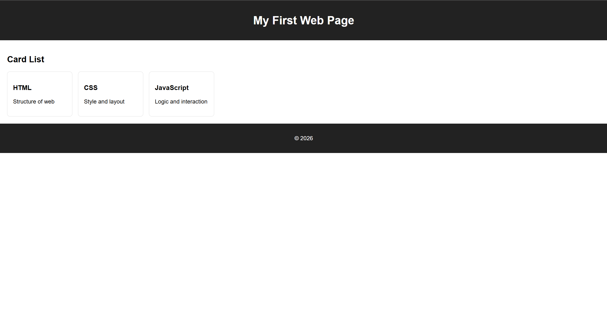

# Day 1 - 웹 개발 기초 구조 이해

## 🖥️ 실행 화면
JavaScript를 이용해 카드 UI를 동적으로 생성한 결과 화면이다.




## 📅 학습 날짜
- 2026-01-21

---

## 🎯 학습 목표
- 웹 개발 기본 파일 구조 이해
- HTML / CSS / JavaScript 역할 구분
- JavaScript로 HTML 요소를 동적으로 생성하는 흐름 이해

---

## 📁 파일 구성

```
day1/
┣ index.html
┣ style.css
┣ script.js
┗ README.md
```

---

## 📄 index.html 역할
- 웹 페이지의 기본 구조를 담당
- header / main / footer로 영역을 나눔
- `link` 태그로 CSS 연결
- `script` 태그로 JavaScript 연결

---

## 🎨 style.css 역할
- HTML 요소들의 디자인 담당
- 카드 레이아웃, 정렬, 색상, 여백 등을 설정
- `.card-container` 안에 카드들이 정렬됨

---

## ⚙️ script.js 역할
- 카드에 들어갈 데이터를 배열로 관리
- `forEach`를 사용해 데이터를 반복
- JavaScript로 카드 요소를 생성하여 HTML에 추가

---

## 💡 오늘 배운 핵심 개념
- HTML은 구조 역할
- CSS는 스타일 역할
- JavaScript는 동작 역할
- JavaScript를 이용하면 HTML을 직접 작성하지 않고도 화면을 만들 수 있다.

---

## ✍️ 느낀 점
- 파일들이 서로 어떻게 연결되는지 이해할 수 있었다.
- JavaScript가 화면을 직접 조작할 수 있다는 점이 인상 깊었다.
- 다음에는 버튼 클릭 같은 이벤트를 적용해보고 싶다.
