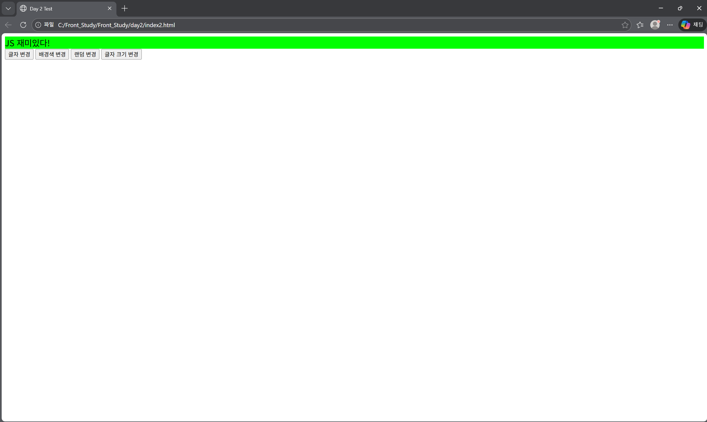

# Day 2 - JavaScript 이벤트 & DOM 조작

## 🖥️ 실행 화면
버튼 클릭과 더블 클릭, 마우스 오버 이벤트로 텍스트/배경/글자 크기 등을 동적으로 변경한 화면이다.



## 📅 학습 날짜
- 2026-01-22

---

## 🎯 학습 목표
- 버튼 클릭, 마우스 이벤트 등 **JavaScript 이벤트(Event) 이해**  
- DOM 요소 선택과 텍스트/스타일 변경 **실습**  
- 직접 코드를 작성하며 **동적 UI 구성 경험**  

---

## 📁 파일 구성

day2/
┣ index.html
┣ script.js
┣ index2.html
┣ script2.js
┗ README.md


---

## 📄 index2.html 역할
- 웹 페이지의 **기본 구조와 버튼 요소** 담당  
- `<div>`에 메시지를 표시  
- 버튼 클릭/더블 클릭/마우스 오버 이벤트 적용  
- `script2.js` 연결  

---

## ⚙️ script2.js 역할
- DOM 요소 선택 (`getElementById`)  
- 이벤트 처리 (`addEventListener`)  
- 텍스트, 배경색, 글자 크기를 변경하는 **동적 기능 구현**  

---

## 💡 오늘 배운 핵심 개념
- `addEventListener`로 클릭, 더블 클릭, 마우스 오버 등 이벤트 적용 가능  
- `textContent` → 텍스트 변경  
- `style.backgroundColor` → 배경색 변경  
- `style.fontSize` → 글자 크기 변경  
- JS로 **HTML 요소를 동적으로 조작**하면 UI를 실시간으로 바꿀 수 있음  

---

## ✍️ 느낀 점
- 클릭/더블 클릭/마우스 오버 이벤트를 직접 만들어보니 이해가 빨랐다.  
- JS로 DOM을 조작하면 HTML을 직접 수정하지 않고도 화면이 바뀌는 게 신기했다.  
- 다음에는 여러 이벤트를 동시에 적용하고, 다른 스타일 속성도 랜덤으로 바꾸는 실습을 해보고 싶다.

---

## 🖱️ 자주 쓰는 이벤트(Event) 정리

### 1️⃣ 마우스 이벤트
| 이벤트 | 설명 |
|--------|------|
| click | 한 번 클릭할 때 실행 |
| dblclick | 더블 클릭할 때 실행 |
| mouseover | 마우스를 요소 위로 올렸을 때 실행 |
| mouseout | 마우스를 요소 밖으로 이동할 때 실행 |
| mousedown | 마우스 버튼을 누를 때 실행 |
| mouseup | 마우스 버튼에서 손을 뗄 때 실행 |
| mousemove | 마우스를 움직일 때 실행 |
| mouseenter | 요소 안으로 들어올 때 실행 (자식 요소 무시) |
| mouseleave | 요소에서 나갈 때 실행 (자식 요소 무시) |

### 2️⃣ 키보드 이벤트
| 이벤트 | 설명 |
|--------|------|
| keydown | 키를 누를 때 실행 |
| keyup | 키에서 손을 뗄 때 실행 |
| keypress | 키를 눌렀을 때 실행 (deprecated, 거의 keydown 사용) |

### 3️⃣ 폼(Form) 이벤트
| 이벤트 | 설명 |
|--------|------|
| submit | 폼 제출 시 실행 |
| change | 입력값이 바뀌고 포커스를 벗어났을 때 실행 |
| input | 입력값이 바뀔 때마다 실행 |
| focus | 입력창 포커스 잡을 때 실행 |
| blur | 입력창 포커스 벗어날 때 실행 |

### 4️⃣ 기타 자주 쓰는 이벤트
| 이벤트 | 설명 |
|--------|------|
| load | 페이지나 이미지 로딩 완료 시 실행 |
| resize | 브라우저 창 크기 변경 시 실행 |
| scroll | 스크롤할 때 실행 |
| contextmenu | 마우스 우클릭 시 실행 |
| wheel | 마우스 휠 움직일 때 실행 |

---

## 🎨 DOM 스타일 속성 예시

| 속성 | 설명 |
|------|------|
| backgroundColor | 배경색 변경 |
| color | 글자 색상 변경 |
| fontSize | 글자 크기 변경 |
| fontFamily | 글꼴 변경 |
| fontWeight | 글자 굵기 변경 |
| textAlign | 글자 정렬 (left/center/right) |
| border | 테두리 설정 (`1px solid black`) |
| borderRadius | 테두리 둥글게 (`10px`) |
| width / height | 크기 설정 |
| margin / padding | 여백 설정 |
| display | `block`, `inline`, `flex` 등 레이아웃 변경 |
| visibility | `visible` / `hidden` 요소 보임 여부 |
| opacity | 투명도 (0~1) |
| zIndex | 겹침 순서 |

💡 Tip:  
- 스타일 변경: `element.style.속성 = "값"`  
- 여러 스타일 동시에 변경: `element.style.cssText = "속성1:값1; 속성2:값2;"`  
- 여기서 element는 오늘 사용한 msg를 생각하면 된다.

### 💡 스타일 조작 예시
```js
msg.style.backgroundColor = "pink";   // 배경색 변경
msg.style.color = "blue";             // 글자 색상 변경
msg.style.fontSize = "24px";          // 글자 크기 변경
msg.style.fontWeight = "bold";        // 글자 굵기 변경
msg.style.border = "2px solid black"; // 테두리 설정
msg.style.borderRadius = "10px";      // 둥근 테두리
msg.style.opacity = "0.8";            // 투명도