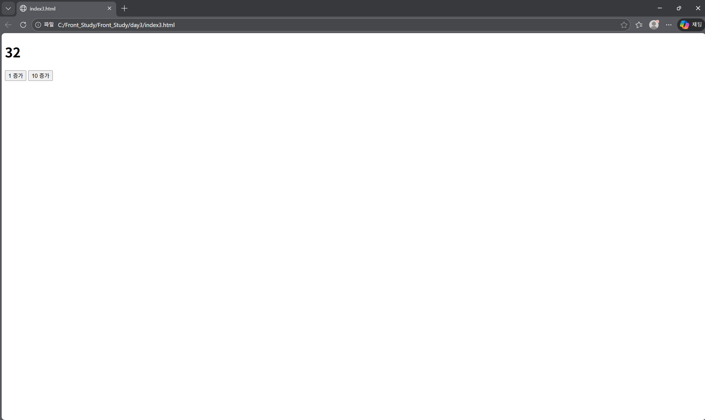

# Day 3 - JavaScript 상태(State) 개념 기초 & 값 변화 제어

## 🖥️ 실행 화면
버튼 클릭을 통해 숫자 값(count)이 증가하거나 감소하고,  
현재 값이 화면에 실시간으로 반영되는 간단한 카운터 화면이다.



## 📅 학습 날짜
- 2026-01-23

---

## 🎯 학습 목표
- 버튼 클릭 이벤트를 통해 **값이 변하는 로직 이해**
- 변수 값 변화가 **화면(UI)에 반영되는 구조 이해**
- 값의 변화를 관리하는 개념으로서 **State의 기초 감각 익히기**
- 이후 React의 `state` 개념을 배우기 위한 사전 준비

---

## 📁 파일 구성

```
day3/
┣ index.html
┣ index2.html
┣ index3.html
┗ README.md
```

---

## 📄 index.html 역할
- 웹 페이지의 기본 구조 담당
- 현재 숫자를 표시할 `<div>` 또는 `<p>` 요소 구성
- 증가(+) / 감소(-) 버튼 배치
- `script.js` 파일 연결

---

## ⚙️ script.js 역할
- `count` 변수 선언 (현재 숫자 값 저장)
- DOM 요소 선택 (`getElementById`)
- 버튼 클릭 이벤트 등록 (`addEventListener`)
- 버튼 클릭 시 `count` 값 증가 / 감소
- 변경된 `count` 값을 화면에 다시 출력

---

## 💡 오늘 배운 핵심 개념

### 1️⃣ 값이 변하는 변수
- `count` 변수는 **현재 상태를 나타내는 값**
- 버튼을 누를 때마다 값이 변함

```
js
let count = 0;
```

### DAY 3에서 배운 내용의 한 줄 요약
- 버튼 이벤트를 통해 값이 변하고, 그 값이 화면에 반영되는 과정을 경험하며 ‘상태(State)’의 개념을 감각적으로 이해했다.