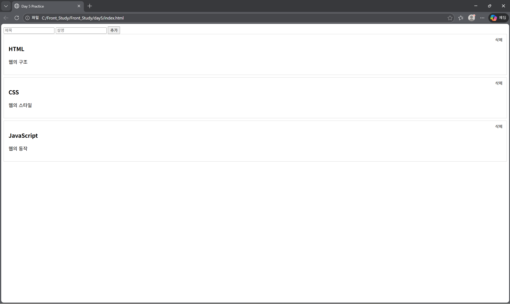

# Day 5 - JavaScript 미니 실습 (카드 / 리스트 동적 UI)

## 🖥️ 실행 화면
JavaScript를 활용해 **카드 UI를 동적으로 생성·추가·삭제**하는 실습을 진행했다.  
HTML에는 최소한의 구조만 두고, 카드 생성 로직은 **JavaScript DOM 조작**으로 구현했다.




- 초기 카드 목록 렌더링
- input 값을 기반으로 카드 추가
- 카드 클릭 시 상태(active) 토글
- 카드 삭제 버튼 구현
- CSS position을 활용한 UI 배치

---

## 📅 학습 날짜
- 2026-01-26

---

## 🎯 학습 목표
- JavaScript를 활용한 DOM 요소 생성 흐름 이해
- 배열 데이터 기반 UI 렌더링(forEach)
- 함수 분리를 통한 코드 재사용 구조 이해
- 이벤트 처리(addEventListener) 흐름 파악
- CSS와 JavaScript의 역할 분리 이해
- position(relative / absolute) 개념 학습

---

## 📁 파일 구성
```
day5/
┣ day5_preview.png
┣ index.html
┣ style.css
┣ script.js
┗ README.md
```


---

## 📄 index.html 역할
- 카드가 삽입될 컨테이너(`#card-container`) 제공
- 사용자 입력을 위한 input 요소 제공
- JavaScript와 CSS 파일 연결
- **UI 구조만 담당**, 동작 로직 없음

---

## ⚙️ script.js 역할
- 카드 데이터 배열 정의
- 카드 생성 함수(`createCard`) 구현
- forEach를 이용한 초기 카드 렌더링
- input 버튼 클릭 시 카드 추가
- 카드 클릭 / 삭제 이벤트 처리
- DOM 조작을 통한 UI 동적 변경

---

## 🎨 style.css 역할
- 카드 UI 스타일 정의
- active 상태 스타일링
- 삭제 버튼 위치 조정
- JavaScript로 생성된 요소에도 동일하게 적용

---

## 💡 오늘 배운 핵심 개념

### 1️⃣ DOM 요소 동적 생성
```js
const card = document.createElement("div");
card.classList.add("card");
```
- JavaScript로 HTML 요소를 직접 생성
- class를 부여해 CSS와 연결

### 2️⃣ 배열 데이터 기반 UI 렌더링 (forEach)
```js
cards.forEach((item) => {
    createCard(item.title, item.desc);
});
```
- 배열의 각 객체를 순회
- 데이터만 전달하고 UI 생성은 함수에서 담당
- 데이터와 UI 로직 분리

### 3️⃣ 함수 분리를 통한 재사용 구조
```js
function createCard(titleText, descText) {
    // 카드 생성 로직
}
```
- 카드 생성 로직을 함수로 분리
- 초기 렌더링 / input 추가 모두 동일한 함수 사용
- 코드 중복 제거 및 가독성 향상

### 4️⃣ 이벤트 처리 (addEventListener)
```js
card.addEventListener("click", () => {
    card.classList.toggle("active");
});
```
- 클릭 이벤트 등록
- class 토글을 통한 상태 변화 구현

### 5️⃣ 입력값 검증 (trim)
```js
if (
    titleInput.value.trim() === "" ||
    descInput.value.trim() === ""
) {
    return;
}
```
- 공백만 입력된 경우 카드 생성 방지
- 사용자 입력 유효성 검사 기본 패턴 학습

### 6️⃣ 카드 삭제 기능 & 이벤트 버블링
```js
deleteBtn.addEventListener("click", (e) => {
    e.stopPropagation();
    card.remove();
});
```
- 버튼 클릭 시 해당 카드만 삭제
- stopPropagation()으로 부모 클릭 이벤트 차단
- 이벤트 전파 개념 이해

### 7️⃣ CSS position 개념
```cs
.card {
    position: relative;
}

.delete-btn {
    position: absolute;
    top: 8px;
    right: 8px;
}
```
- absolute 요소는 가장 가까운 relative를 기준으로 배치
- 카드 기준으로 삭제 버튼 위치 고정
- UI 배치의 핵심 개념 학습

### 🧠 DAY 5에서 배운 내용 한 줄 요약
- JavaScript를 통해 DOM을 직접 생성·제어하며,
배열 데이터 → UI 렌더링 → 이벤트 처리 → CSS 스타일링으로 이어지는
프론트엔드 동적 UI의 전체 흐름을 경험했다.
```css
HTML  → 구조
CSS   → 스타일
JS    → 생성 + 동작
```
- UI는 데이터로부터 만들어지고,
- 동작은 이벤트로 제어되며,
- 스타일은 class를 통해 분리 관리된다.
